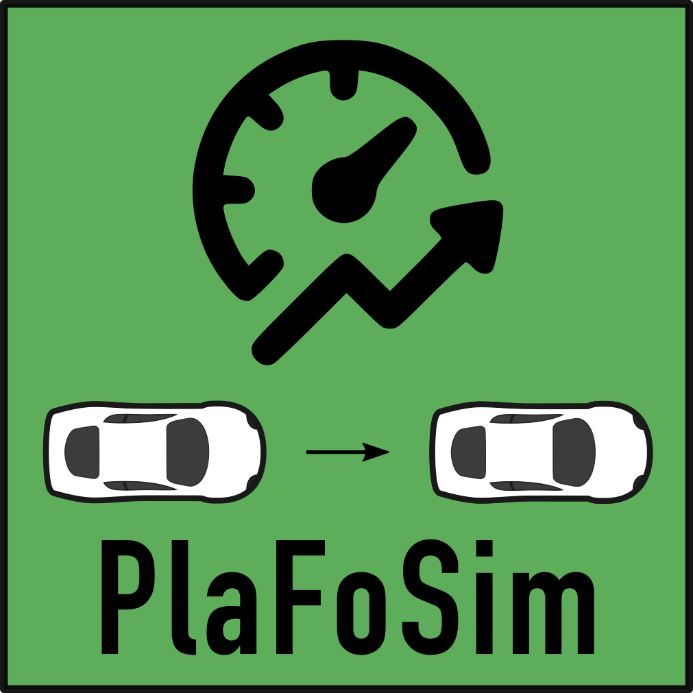

# PlaFoSim - A simple and scalable simulator for platoon formation
[](CHANGELOG.md)
[](https://pypi.org/project/plafosim/)
[](https://pypi.org/project/plafosim/)
[](LICENSE)
[](http://dx.doi.org/10.1109/VNC52810.2021.9644678)


"Platoon Formation Simulator", or "PlaFoSim" for short, is an open source simulator for platoon formation, aiming for simplicity, flexibility, and scalability.
PlaFoSim aims to facilitate and accelerate the research of platoon maneuvers and formation for individually driven vehicles.
While the main focus of the simulator is on the assignment process, simulation of advertisements and maneuvers is implemented in a more abstract way.

PlaFoSim has been published at [IEEE VNC 2021](https://www.tkn.tu-berlin.de/bib/heinovski2021scalable/):

> Julian Heinovski, Dominik S. Buse and Falko Dressler, "Scalable Simulation of Platoon Formation Maneuvers with PlaFoSim," Proceedings of 13th IEEE Vehicular Networking Conference (VNC 2021), Poster Session, Virtual Conference, November 2021, pp. 137–138.

**NOTE**: This project is under active development.

---

## Installation

- Install Python (>=3.7,<=3.9)
- Install PlaFoSim from [pypi](https://pypi.org/project/plafosim/):
```pip install plafosim```

**NOTE**: The project is developed and tested only on Linux.

## Running a Simulation

**NOTE**: Since PlaFoSim is a command-line interface (CLI) application, running PlaFoSim requires using a shell.

### Quickstart

Run PlaFoSim with:

```plafosim```

You can use PlaFoSim's help to get a list of available parameters:

```plafosim -h, --help```

Or, run a simulation with the default configuration (`-d`):

```plafosim -d```

### Live GUI

You can visualize the simulation via a simple live GUI based on [sumo-gui](https://sumo.dlr.de/docs/sumo-gui.html), using the argument `gui`:

```plafosim --gui```


*A screenshot of PlaFoSim's live GUI showing 2 platoons and various individual vehicles. Copyright © 2021 IEEE.*

More options for the live GUI can be found within the ``GUI properties`` section of the help.

**NOTE**: This requires installation of [SUMO](https://sumo.dlr.de/) (>=1.6.0) and declaration of the `SUMO_HOME` variable (see [documentation](https://sumo.dlr.de/docs/Installing/Linux_Build.html#definition_of_sumo_home)).

### Advanced Simulation Control

You can use a variety of different parameters to customize the scenario and the simulation itself.
E.g., use the parameter `vehicles` to configure the number of vehicles in the simulation:

```plafosim --vehicles 1000```

The available parameters are grouped into different categories:

```
- road network properties
- vehicle properties
- trip properties
- communication properties
- platoon properties
- formation properties
- infrastructure properties
- simulation properties
- GUI properties
- result recording properties
```

You can find a list of available parameters for each category in the help:

```plafosim -h, --help```

#### Examples

```
# Configure a 100km freeway with ramps at every 10km
plafosim --road-length 100 --ramp-interval 10

# Configure random (normally distributed) desired driving speed of 130km/h
plafosim --random-desired-speed true --desired-speed 36

# Configure random trips for 500 vehicles
plafosim --vehicles 500 --random-depart-position true --random-arrival-position true --depart-desired true

# Pre fill the freeway with 1000 vehicles
plafosim --vehicles 1000 --pre-fill true

# Configure 50% of the vehicles with Advanced Cruise Control (ACC) and a headway time of 1.5s
plafosim --penetration 0.5 --acc-headway-time 1.5

# Enable a simple, distributed platoon formation algorithm [1] in order to form platoons every 30s
plafosim --formation-algorithm SpeedPosition --formation-strategy distributed --execution-interval 30
```

### Faster Simulation

You can speed up the simulation performance by enabling Python's optimization ```PYTHONOPTIMIZE```, e.g., in order to disable assertions:

```PYTHONOPTIMIZE=1 plafosim```

See the Python [documention](https://docs.python.org/3/using/cmdline.html#envvar-PYTHONOPTIMIZE) for more details.

## Re-Playing a Simulation

The simulation can write a trace file including the mobility details of every simulated vehicle (default `results_vehicle_traces.csv`).
You can replay the simulation in the GUI (see above) based on the trace file by using the corresponding binary:

```plafosim-replay results_vehicle_traces.csv```

To see all options of this script, run:

```plafosim-replay -h, --help```

**NOTE**: This requires installation of SUMO (>=1.6.0) and declaration of the `SUMO_HOME` variable.

## Recording of Screenshots and Video from a Simulation

PlaFoSim offers functionality to automatically record a screenshot of the GUI in every simulation step with

```plafosim --gui --screenshot-file screenshot```

These screenshots can be used to create a video by using an integrated script based on [ffmpeg](https://ffmpeg.org/):

```plafosim-img2video 'screenshot_*.png' video.mp4```

**NOTE**: This requires installation of ffmpeg.

## Documentation

Documentation is available via this README and via the [official documentation](https://plafosim.readthedocs.io/).

## Extending PlaFoSim

You can extend and customize PlaFoSim flexibly by modifying its source code.
For this, you first need ot install it from source.

### Installing from Source

- Install [poetry](https://python-poetry.org/):
```pip install poetry```
- Clone this repository:
```git clone https://github.com/heinovski/plafosim.git```
- Navigate to newly created directory of the cloned repository in the command-line
- Install PlaFoSim from source in editable mode:
```poetry install```
- Run PlaFoSim in the virtual environment:
```poetry run plafosim```
You can also activate the virtual enviroment first with ```poetry shell``` and run the commands as usual (see above).

### Adding a new Formation Algorithm

In order to add a new formation algorithm, you need to follow these steps:
- Create a new sub-class of `FormationAlgorithm` (see `formation_algorithm.py`) within the sub-directory `algorithms`.
You can use the `Dummy` algorithm (see `algorithms/dummy.py`) as an example.
- Add specific arguments for your algorithm to the argument parser group within the new sub-class if necessary.

You should now be able to use your new algorithm with
```
plafosim --formation-algorithm dummy_algorithm_name
```

## Contributing to the Project

In order to contribute, please follow these steps:
- Install PlaFoSim from source (see [Extending PlaFoSim](.#extending-plafosim))
- Make desired changes and adjust the documentation if required
- Run the tests located in `tests` as well as the validation scripts located in `scripts` (see `.drone.yml` for details)
- Submit a Pull Request (PR)

### Documenting

When making changes to the code, make sure to add or adjust corresponding documentation in form of python docstrings.
Those should use the Numpy docstring format for Sphinx and follow the [style guide](https://numpydoc.readthedocs.io/en/latest/format.html) by numpydoc to ensure consistency and compatibility.
See also the [style guide](https://pandas.pydata.org/docs/development/contributing_docstring.html) by pandas.
You can build the documentation using Sphinx `make -C docs`.

### Testing

When adding methods and functions, make sure to add corresponding unit tests for `py.test`.
The tests are located under `tests` and can be executed with `./scripts/run-pytest.sh`.
This will also generate a test coverage report.

### Validation

To validate the behavior of PlaFoSim, it is compared to SUMO 1.6.0 by means of simulation results (e.g., vehicle traces).
The corresponding scripts are located under `scripts` and executed withn CI/CD pipelines.
You can have a look at `.drone.yml` for details regarding the execution.

### Profiling

You can profile the runtime of PlaFoSim's code by using [cProfile](https://docs.python.org/3/library/profile.html#module-cProfile):

```poetry run python -m cProfile -o profile.out -m plafosim.cli.plafosim```

You can visualize the results of the profiling run by using [SnakeViz](https://jiffyclub.github.io/snakeviz/):

```snakeviz profile.out```

## Contributors & Citing

PlaFoSim was originally designed and built by [Julian Heinovski](https://github.com/heinovski/) with the help of [Dominik S. Buse](https://github.com/dbuse/).
It is currently maintained by [Julian Heinovski](https://github.com/heinovski/).
The list of all authors can be found [here](AUTHORS.md).

If you are working with `PlaFoSim`, we would appreciate a citation of [our paper](https://www.tkn.tu-berlin.de/bib/heinovski2021scalable/):

> Julian Heinovski, Dominik S. Buse and Falko Dressler, "Scalable Simulation of Platoon Formation Maneuvers with PlaFoSim," Proceedings of 13th IEEE Vehicular Networking Conference (VNC 2021), Poster Session, Virtual Conference, November 2021, pp. 137–138.

```bibtex
@inproceedings{heinovski2021scalable,
    author = {Heinovski, Julian and Buse, Dominik S. and Dressler, Falko},
    doi = {10.1109/VNC52810.2021.9644678},
    title = {{Scalable Simulation of Platoon Formation Maneuvers with PlaFoSim}},
    pages = {137--138},
    publisher = {IEEE},
    issn = {2157-9865},
    isbn = {978-1-66544-450-7},
    address = {Virtual Conference},
    booktitle = {13th IEEE Vehicular Networking Conference (VNC 2021), Poster Session},
    month = {11},
    year = {2021},
}
```

## License

PlaFoSim is licensed under the terms of the GNU General Public License 3.0 or later.

```
# Copyright (c) 2020-2024 Julian Heinovski <heinovski@ccs-labs.org>
#
# SPDX-License-Identifier: GPL-3.0-or-later
#
# This program is free software: you can redistribute it and/or modify
# it under the terms of the GNU General Public License as published by
# the Free Software Foundation, either version 3 of the License, or
# any later version.
#
# This program is distributed in the hope that it will be useful,
# but WITHOUT ANY WARRANTY; without even the implied warranty of
# MERCHANTABILITY or FITNESS FOR A PARTICULAR PURPOSE.  See the
# GNU General Public License for more details.
#
# You should have received a copy of the GNU General Public License
# along with this program.  If not, see <https://www.gnu.org/licenses/>.
```
