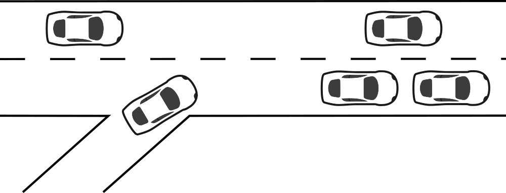
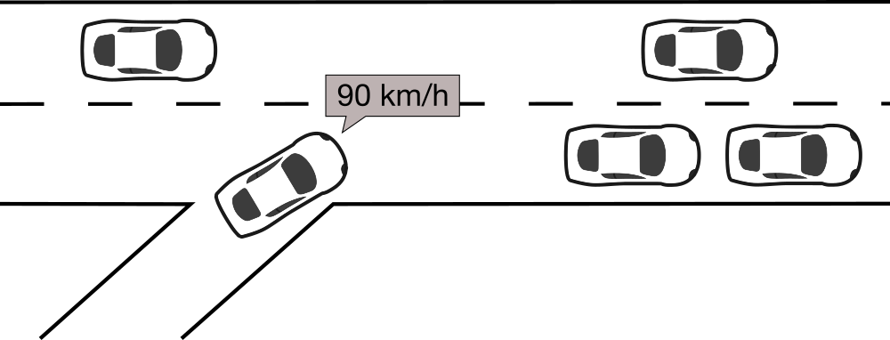
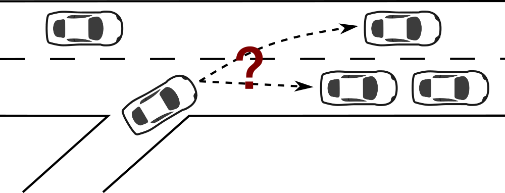
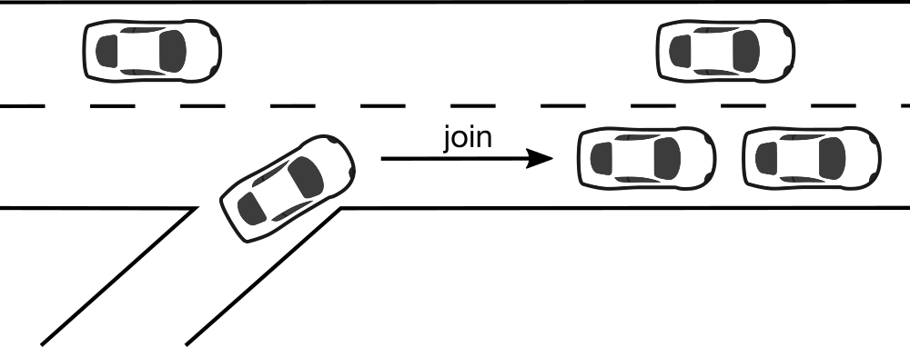
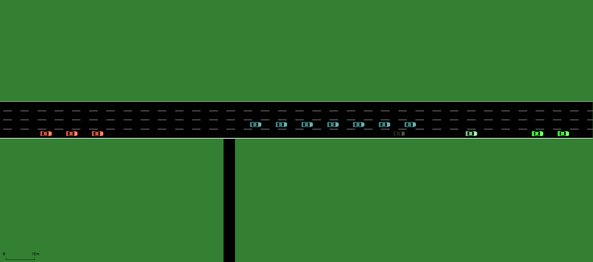

# Platoon Formation Simulator (PlaFoSim)

[](CHANGELOG.md)
[](https://pypi.org/project/plafosim/)
[](https://pypi.org/project/plafosim/)
[](https://github.com/heinovski/plafosim)
[](http://dx.doi.org/10.1109/VNC52810.2021.9644678)

[PlaFoSim](https://www.plafosim.de) - A simple and scalable simulator for platoon formation.

PlaFoSim aims to facilitate and accelerate the research of platoon maneuvers and formation for individually driven vehicles.
While the main focus of the simulator is on the assignment process, simulation of advertisements and maneuvers is implemented in a more abstract way.

| Scenario | Advertisement | Assignment | Maneuver |
| -------- | ------------- | ---------- | -------- |
 |  |  |  |

PlaFoSim is published here:

> Julian Heinovski, Dominik S. Buse and Falko Dressler, "Scalable Simulation of Platoon Formation Maneuvers with PlaFoSim," Proceedings of 13th IEEE Vehicular Networking Conference (VNC 2021), Poster Session, Virtual Conference, November 2021.

Please note that PlaFoSim is still under heavy development.

---

## Installation

- Install Python (>=3.7.0,<3.10)
- Optionally, install [SUMO](https://github.com/eclipse/sumo/) (>=1.6.0)
- Install PlaFoSim via pypi:
```pip install plafosim```

NOTE: The project is currently only tested under Linux.

## Running a Simulation

You can use the simulator as module as well as from the command-line.
Currently, only command-line is thoroughly tested and thus completely available though.

### Quickstart

Use PlaFoSim's binary to run a simulation with the default configuration:

```plafosim -d```

### Advanced Simulation Control

You can use a variety of different parameters to customize the scenario and the simulation itself.
E.g., use the parameter `vehicles` to configure the number of vehicles in the simulation:

```plafosim --vehicles 1000```

The available parameters are grouped into different categories:

```
- road network properties
- vehicle properties
- trip properties
- communication properties
- platoon properties
- formation properties
- infrastructure properties
- simulation properties
- gui properties
- result recording properties
```

You can see the complete list of available parameters in the help:

```plafosim -h, --help```

### Examples

```
# Configure a 100km freeway with ramps at every 10km
plafosim --road-length 100 --ramp-interval 10

# Configure random (normally distributed) desired driving speed of 130km/h
plafosim --random-desired-speed true --desired-speed 36

# Configure random trips for 500 vehicles
plafosim --vehicles 500 --random-depart-position true --random-arrival-position true --depart-desired true

# Pre fill the freeway with 1000 vehicles
plafosim --vehicles 1000 --pre-fill true

# Configure 50% of the vehicles with Advanced Cruise Control (ACC) and a headway time of 1.5s
plafosim --penetration 0.5 --acc-headway-time 1.5

# Enable a simple, distributed platoon formation algorithm [1] in order to form platoons every 30s
plafosim --formation-algorithm SpeedPosition --formation-strategy distributed --execution-interval 30
```

### Live GUI

You can get a very simple live GUI based on SUMO by using the parameter `gui` (requires installation of SUMO and decleration of `SUMO_HOME` variable):

```plafosim --gui```



More options for the live GUI can be found within the ``gui properties`` section of the help.

### Faster Simulation

You can speed up the simulation performance by enabling Python's optimization ```PYTHONOPTIMIZE```, e.g., in order to disable assertions:

```PYTHONOPTIMIZE=1 plafosim```

See the Python [documention](https://docs.python.org/3/using/cmdline.html#envvar-PYTHONOPTIMIZE) for more details.

## Re-Playing a Simulation

The simulation can write a trace file for every simulated vehicle (default `results_vehicle_traces.csv`).
You can replay the simulation based on the trace file by using a corresponding binary:

```plafosim-replay results_vehicle_traces.csv```

To see all options of this script, run:

```plafosim-replay -h, --help```

## Extending

- Clone the repository
- Install poetry
```pip install poetry```
- Install PlaFoSim from source in editable mode
```poetry install```
- Run PlaFoSim in the virtual environment with
```poetry run plafosim```
or activate the virtual enviroment first with
```poetry shell```
and run the commands as usual (see above)

NOTE: The project is currently only tested under Linux.

In order to add a new formation algorithm, you need to follow these steps:
- Create a new sub-class of `FormationAlgorithm` (see `formation_algorithm.py`). You can use the `Dummy` algorithm (see `algorithms/dummy.py`) as an example.
- Import your algorithm and add its `__name__` to the list of available algorithms (see `--formation-algorithm`) within `cli/plafosim.py`.
- Add specific properties of your algorithm via an argument parser group to `cli/plafosim.py` if necessary.
- Import your algorithm and add parsing of its `__name__` to `__init__` within `PlatooningVehicle` (see `platooning_vehicle.py`) and/or `Infrastructure` (see `infrastructure.py`).

You should now be able to use your new algorithm with
```
plafosim --formation-algorithm dummy_algorithm_name
```

## Contributing

In order to contribute, please follow these steps:
- Install PlaFoSim from source (see above)
- Make desired changes
- Run the tests located in `scripts` (see `.drone.yml`)
- Submit a Pull Request (PR)

### Testing

When adding methods and functions, make sure to add corresponding unit tests for `py.test`.
The tests are located under `tests` and can be executed with `./scripts/run-pytest.sh`.
This will also generate a test coverage report.

### Validation

To validate the behavior of PlaFoSim, it is compared to SUMO 1.6.0 by means of simulation results (e.g., vehicle traces).
The corresponding scripts are located under `scripts` and executed withn CI/CD pipelines.
You can have a look at `.drone.yml` for details regarding the execution.

## Citing

If you are working with `PlaFoSim`, please cite the following paper:

> Julian Heinovski, Dominik S. Buse and Falko Dressler, "Scalable Simulation of Platoon Formation Maneuvers with PlaFoSim," Proceedings of 13th IEEE Vehicular Networking Conference (VNC 2021), Poster Session, Virtual Conference, November 2021.

```bibtex
@inproceedings{heinovski2021scalable,
    author = {Heinovski, Julian and Buse, Dominik S. and Dressler, Falko},
    title = {{Scalable Simulation of Platoon Formation Maneuvers with PlaFoSim}},
    publisher = {IEEE},
    issn = {2157-9865},
    isbn = {978-1-66544-450-7},
    address = {Virtual Conference},
    booktitle = {13th IEEE Vehicular Networking Conference (VNC 2021), Poster Session},
    month = {11},
    year = {2021},
}
```

## References

[1] Julian Heinovski and Falko Dressler, "Platoon Formation: Optimized Car to Platoon Assignment Strategies and Protocols," Proceedings of 10th IEEE Vehicular Networking Conference (VNC 2018), Taipei, Taiwan, December 2018.

## License
```
# Copyright (c) 2020-2022 Julian Heinovski <heinovski@ccs-labs.org>
#
# This program is free software: you can redistribute it and/or modify
# it under the terms of the GNU General Public License as published by
# the Free Software Foundation, either version 3 of the License, or
# any later version.
#
# This program is distributed in the hope that it will be useful,
# but WITHOUT ANY WARRANTY; without even the implied warranty of
# MERCHANTABILITY or FITNESS FOR A PARTICULAR PURPOSE.  See the
# GNU General Public License for more details.
#
# You should have received a copy of the GNU General Public License
# along with this program.  If not, see <https://www.gnu.org/licenses/>.
```
