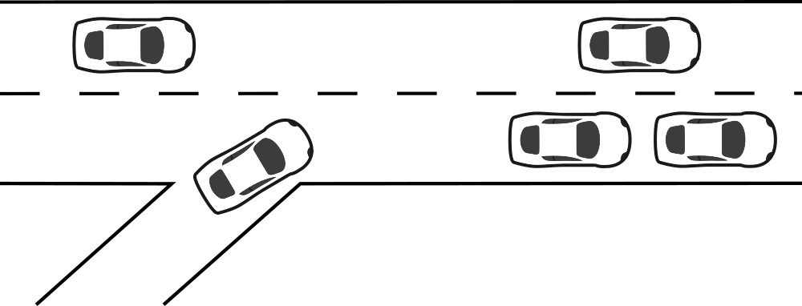
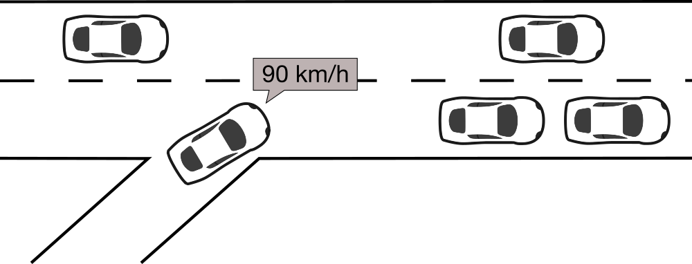
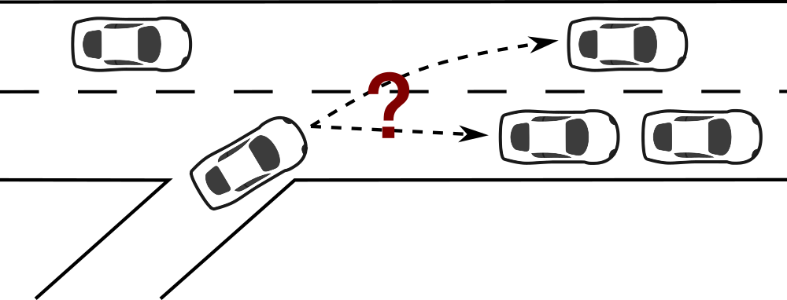

Introduction
============

The following documentation is based on our initial publication at `IEEE VNC 2021 <https://www.tkn.tu-berlin.de/bib/heinovski2021scalable/>`_.

About
-----

PlaFoSim is a simulator for platoon formation on freeways.
It is implemented as an integrated, stand-alone command-line tool based on Python 3 and only a few additional libraries.
The focus of the simulation is on vehicle-to-platoon assignment algorithms.
Thus, platooning mobility, wireless communication, and platooning maneuvers are implemented in a more abstract way.
PlaFoSim enables fast integration of new algorithms, easy configuration via command line arguments, and fast simulation of large-scale scenarios.
For easy inspection, debugging, and show-casing, PlaFoSim uses Sumo to integrate a live GUI.
PlaFoSim can record statistics such as vehicle speeds and positions, fuel consumption, and emissions, as well as platoon formation data, platoon sizes, and performed maneuvers.
Produced traces can later be visualized in the GUI or processed with external tools.

Architecture
------------

PlaFoSim is based on the concept for microscopic simulation of multi-lane traffic proposed by `Krauß <https://www.tkn.tu-berlin.de/bib/krauss1998microscopic/>`_.
Thus, its main simulation loop consist of the following steps:
(1) insert new vehicles,
(2) trigger actions (e.g., running formation algorithms, recording statistics),
(3) execute lane changes,
(4) execute car- following models to update vehicle speeds,
(5) update vehicle positions,
and (6) perform collision checks among all vehicles.
Afterwards, PlaFoSim updates the live GUI, records further statistics, and advances the simulation time.
These steps are subject to a discrete characteristic of the simulator.

Scenario & Simulation Configuration
-----------------------------------

PlaFoSim focuses on simulating long freeways with multiple lanes and periodic on-/off-ramps, which are used by the vehicles to enter and leave the freeway.
The road network (e.g., length, number of lanes) as well as simulation time and steps can be configured via parameters.
Vehicle influx is configured in a macroscopic way via (1) a flow with constant insertion (e.g., by departure rate) or (2) a constant number of vehicles.
Independent of the method, vehicles drive trips of configurable length between on-/off-ramps.
The desired driving speed of a vehicle can be sampled from a normal distribution.
A penetration rate chooses between human driving and platooning.
To reduce effects from the initial transient period, PlaFoSim allows pre-filling the scenario according to a target density (i.e., vehicles per km and lane) before the simulation starts.
Deterministic variation of stochastic behavior can be achieved through a random seed.

Vehicle Dynamics
----------------

Longitudinal (speed) and lateral (lane) control of vehicles follow the models also used in Sumo and Plexe.
This facilitates the validation of the results.
It also enables a migration path for porting promising platoon formation strategies from PlaFoSim to these simulators with higher levels of detail.
Multiple car following models are implemented for longitudinal control: A `Krauss model <https://www.tkn.tu-berlin.de/bib/krauss1998microscopic/>`_ for human-driven vehicles, Adaptive Cruise Control (ACC) similar to `Plexe <https://plexe.car2x.org/>`_, and CACC for platooning (see `Vehicle Dynamics and Control <http://dx.doi.org/10.1007/978-1-4614-1433-9>`_).
CACC abstracts communication and platoon control by transferring the speed of the leader vehicle to all its followers without delay.
Lateral control for lane changing is also modeled following the Sumo implementation.
Vehicles aim to stay on the rightmost lane, but can perform multi-lane overtake maneuvers if needed.
Platoons can also perform overtake maneuvers by executing lane-changes simultaneously.

Platoon Formation
-----------------

Conceptual Overview
^^^^^^^^^^^^^^^^^^^

A conceptional overview of the process of Platoon Formation that is employed in PlaFoSim:

1. Scenario: A new vehicle enters the highway.

2. Advertisement: The vehicle advertises itself as interested in Platooning.

3. Assignment: A Vehicle-to-Platoon assignment is computed.

4. Maneuver: The new vehicle performs a join maneuver.

.. image:: maneuver.png
   :scale: 40%

Implementation in PlaFoSim
^^^^^^^^^^^^^^^^^^^^^^^^^^

Platoon formation is performed within actions, either by individual vehicles or centrally coordinated.
Actions in general are triggered at every simulation step but the period for executing the platoon formation algorithms can be bigger (e.g., 60 s).
Forming platoons typically consist of three steps:
(1) data collection of available vehicles and platoons,
(2) computation of vehicle-to-platoon assignments,
(3) execution of maneuvers.
PlaFoSim simplifies some driving maneuvers and communication details in order to boost simulation performance in extensive scenarios.
Vehicles know other vehicles within a certain range whereas central coordinators have complete knowledge about the scenario.
Platoon formation algorithms utilize the available knowledge to compute optimal vehicle-to-platoon assignments.
Desired assignments are fulfilled by join maneuvers which teleport vehicles to their designated platoon position, considering the approximate time for approaching.
New algorithms and corresponding parameters can be quickly integrated into the existing code.

Included Console Scripts
------------------------

PlaFoSim includes the following console scripts

- :doc:`plafosim <api/plafosim.cli.plafosim>`: The actual simulator for platoon formation
- :doc:`plafosim-replay <api/plafosim.cli.trace_replay>`: A tool to replay simulation traces in a GUI
- :doc:`plafosim-img2video <api/plafosim.cli.img2video>`: A tool to create a video from continuous screenshots

Further Reading
---------------

- https://www.tkn.tu-berlin.de/bib/heinovski2021scalable/
- https://www.tkn.tu-berlin.de/bib/heinovski2018platoon/
- https://www.tkn.tu-berlin.de/bib/heinovski2023where-preprint/
